#  Дипломная работа по профессии «Системный администратор»

Содержание
==========
* [Задача](#Задача)
* [Инфраструктура](#Инфраструктура)
    * [Сайт](#Сайт)
    * [Мониторинг](#Мониторинг)
    * [Логи](#Логи)
    * [Сеть](#Сеть)
    * [Резервное копирование](#Резервное-копирование)
    * [Дополнительно](#Дополнительно)
* [Выполнение работы](#Выполнение-работы)
* [Критерии сдачи](#Критерии-сдачи)
* [Как правильно задавать вопросы дипломному руководителю](#Как-правильно-задавать-вопросы-дипломному-руководителю) 

---------
## Задача
Ключевая задача — разработать отказоустойчивую инфраструктуру для сайта, включающую мониторинг, сбор логов и резервное копирование основных данных. Инфраструктура должна размещаться в [Yandex Cloud](https://cloud.yandex.com/).

## Инфраструктура
Для развёртки инфраструктуры используйте Terraform и Ansible. 

### Использую terraform apply
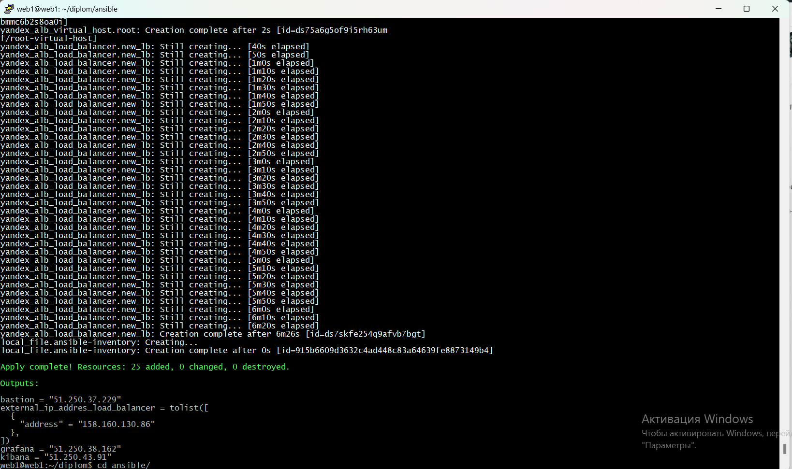

Параметры виртуальной машины (ВМ) подбирайте по потребностям сервисов, которые будут на ней работать. 

### Проверяем параметры созданых виртуальных машин
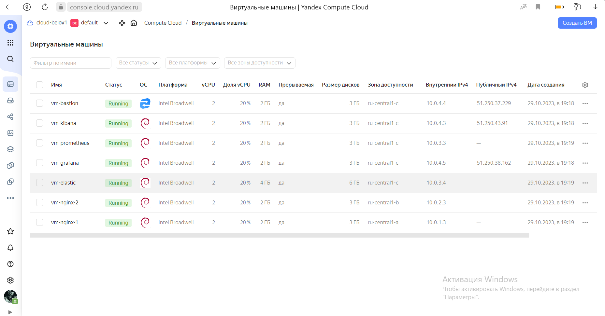

## Действующие IP- адреса
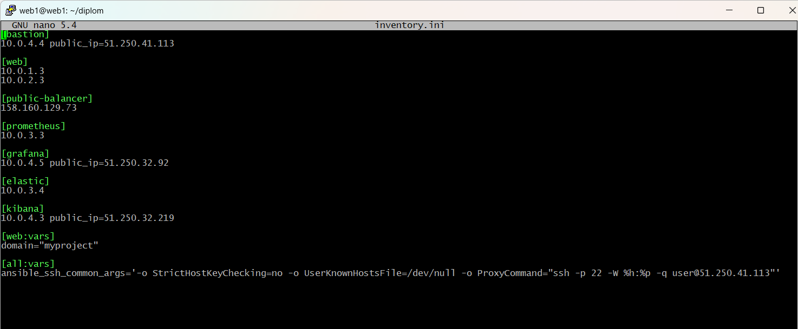

## Сайт
Создайте две ВМ в разных зонах, установите на них сервер nginx, если его там нет. ОС и содержимое ВМ должно быть идентичным, это будут наши веб-сервера.

Используйте набор статичных файлов для сайта. Можно переиспользовать сайт из домашнего задания.

Создайте [Target Group](https://cloud.yandex.com/docs/application-load-balancer/concepts/target-group), включите в неё две созданных ВМ.

### Проверяем созданую Target Group
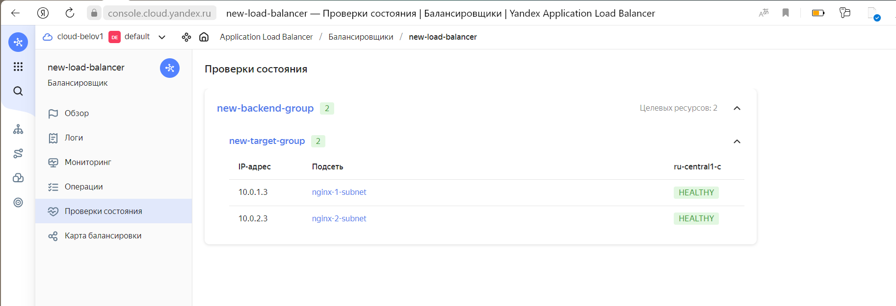

Создайте [Backend Group](https://cloud.yandex.com/docs/application-load-balancer/concepts/backend-group), настройте backends на target group, ранее созданную. Настройте healthcheck на корень (/) и порт 80, протокол HTTP.

Создайте [HTTP router](https://cloud.yandex.com/docs/application-load-balancer/concepts/http-router). Путь укажите — /, backend group — созданную ранее.

Создайте [Application load balancer](https://cloud.yandex.com/en/docs/application-load-balancer/) для распределения трафика на веб-сервера, созданные ранее. Укажите HTTP router, созданный ранее, задайте listener тип auto, порт 80.

### Проверяем созданую группу безопасности
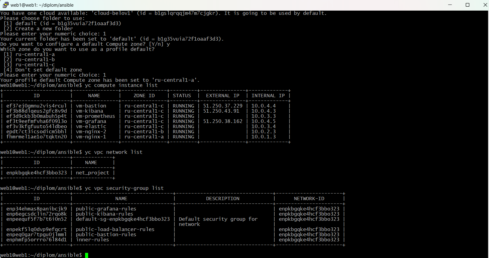

### С помощью Ansible проверяем доступность созданых вертуальных машин
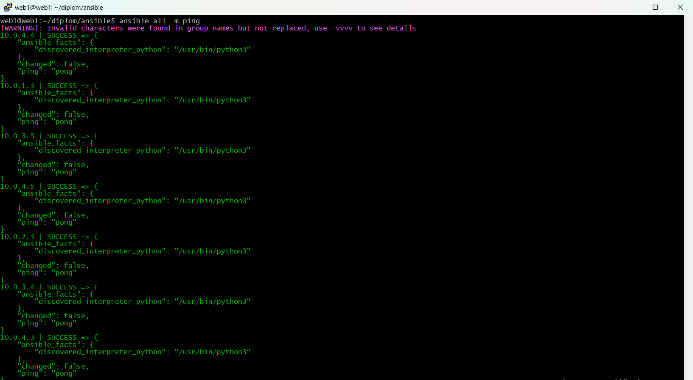

### Устанавливаем Nginx на машины
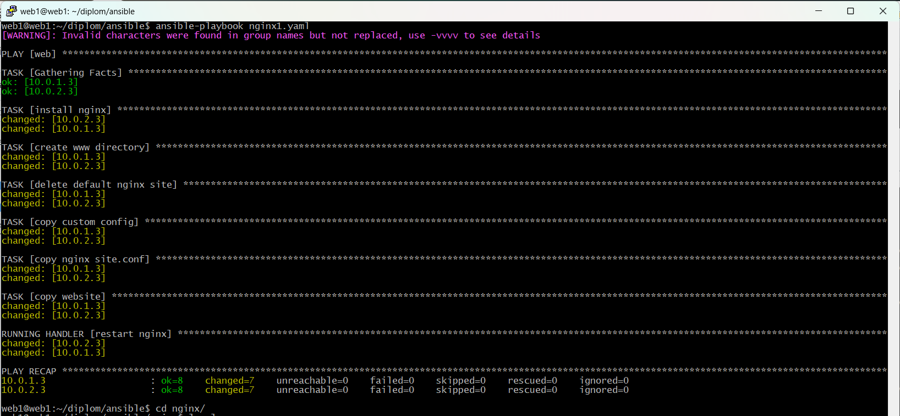
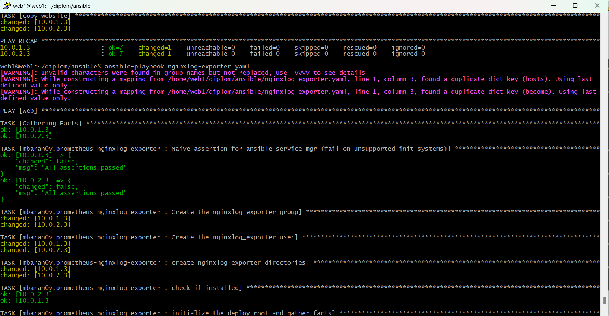

### Тестируем сайт `curl -v <публичный IP балансера>:80` 
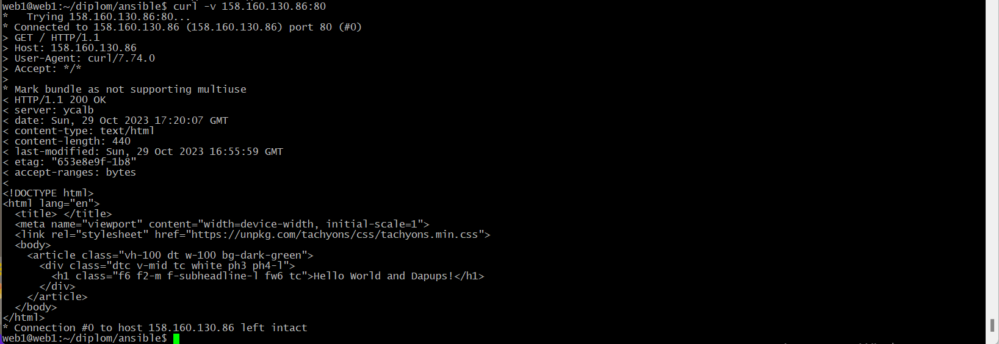

## Мониторинг
Создайте ВМ, разверните на ней Prometheus. На каждую ВМ из веб-серверов установите Node Exporter и [Nginx Log Exporter](https://github.com/martin-helmich/prometheus-nginxlog-exporter). Настройте Prometheus на сбор метрик с этих exporter.

### Разворачиваем на отдельной вертуальной машине Prometheus
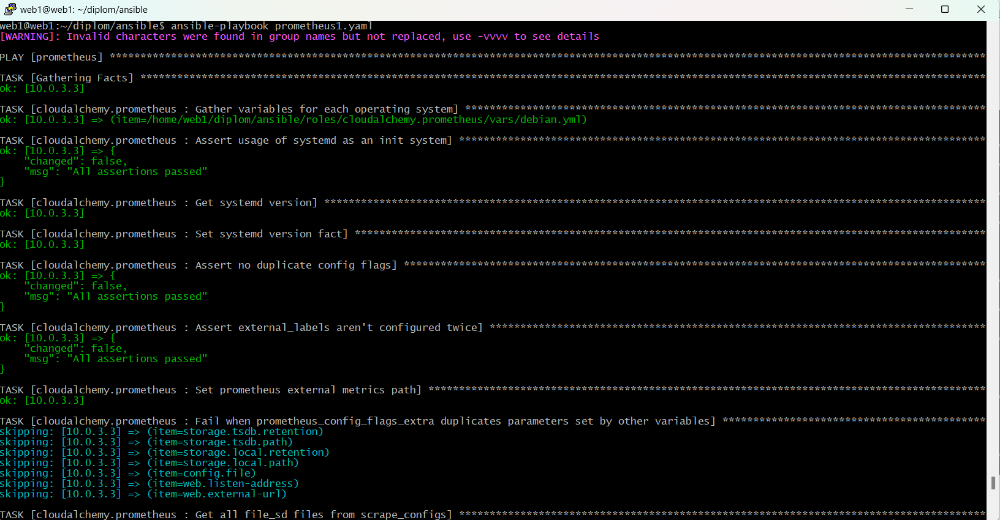

### Проверяем доступность Prometheus.service
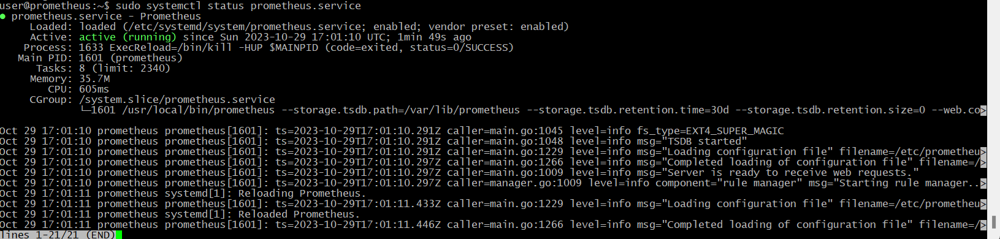

### Устанавливаем Node Exporter
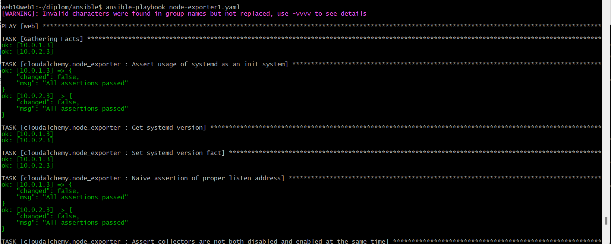

Создайте ВМ, установите туда Grafana. Настройте её на взаимодействие с ранее развернутым Prometheus. Настройте дешборды с отображением метрик, минимальный набор — Utilization, Saturation, Errors для CPU, RAM, диски, сеть, http_response_count_total, http_response_size_bytes. Добавьте необходимые [tresholds](https://grafana.com/docs/grafana/latest/panels/thresholds/) на соответствующие графики.

### Устанавливаем Grafana
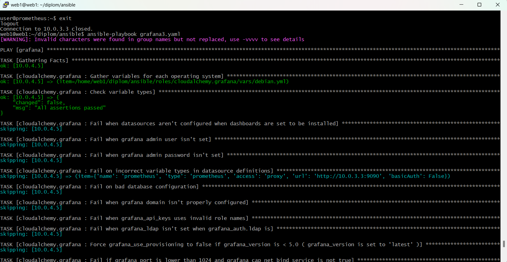

### Проверяем доступность дешборда
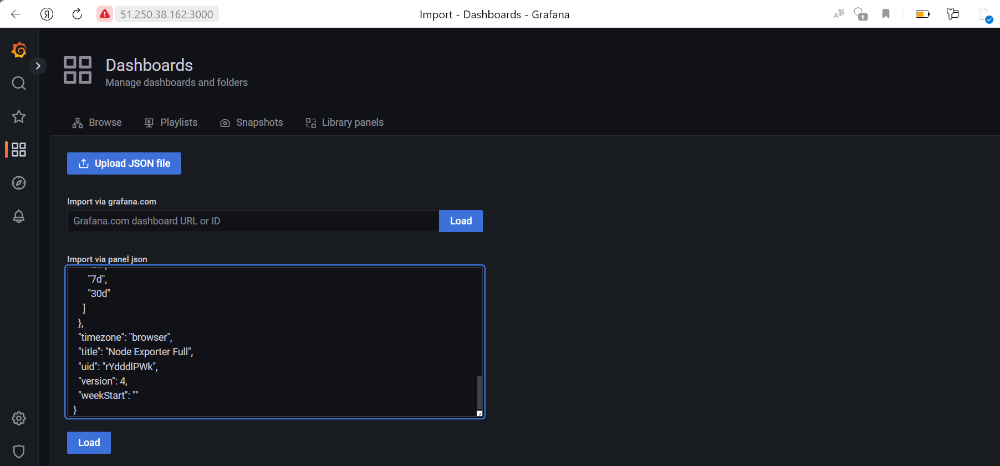

### Смотрим метрики
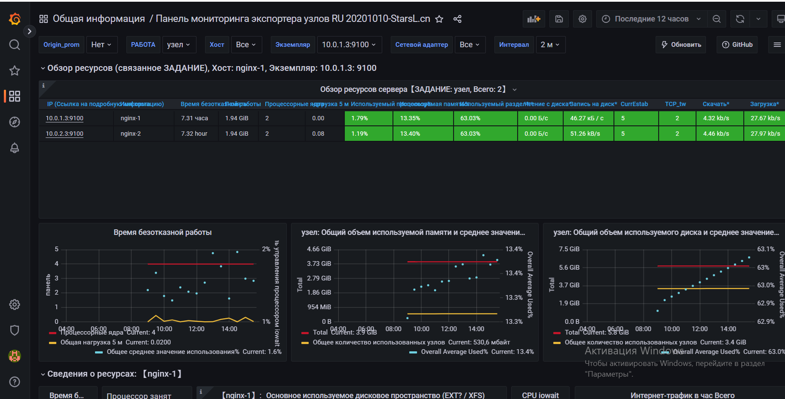

## Логи
Cоздайте ВМ, разверните на ней Elasticsearch. Установите filebeat в ВМ к веб-серверам, настройте на отправку access.log, error.log nginx в Elasticsearch.

### Устанавливаем Elasticsearch
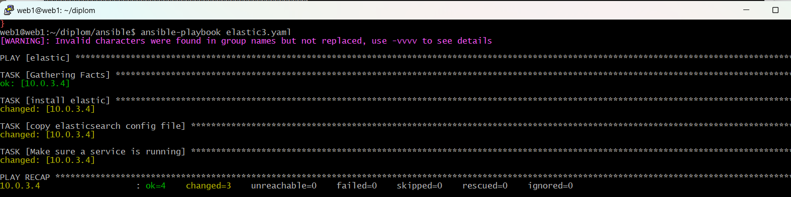

### Проверяем доступность Elasticsearch.service
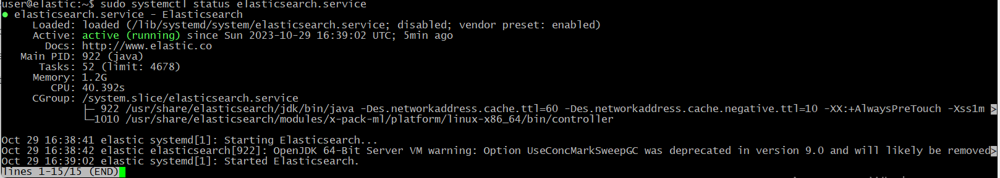

### Устанавливаем filebeat
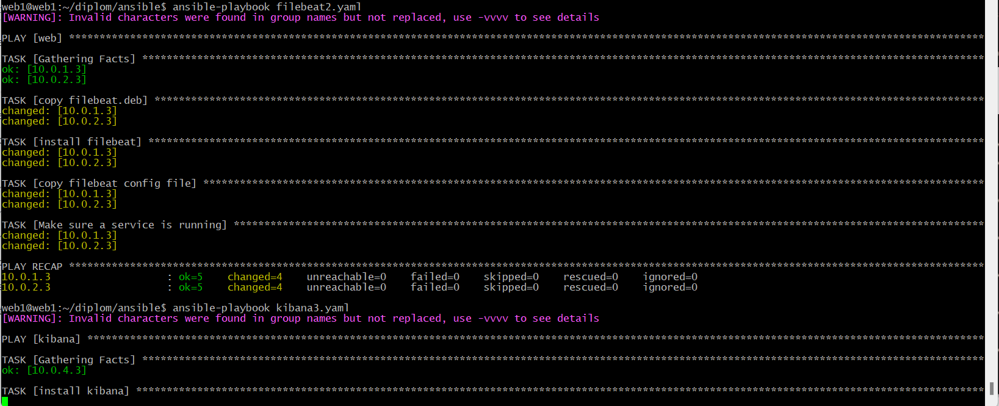

Создайте ВМ, разверните на ней Kibana, сконфигурируйте соединение с Elasticsearch.

### Устанавливаем Kibana
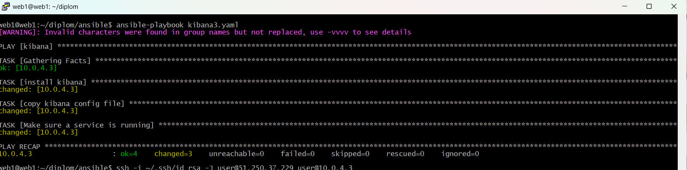

### Проверяем доступность Kibana.service
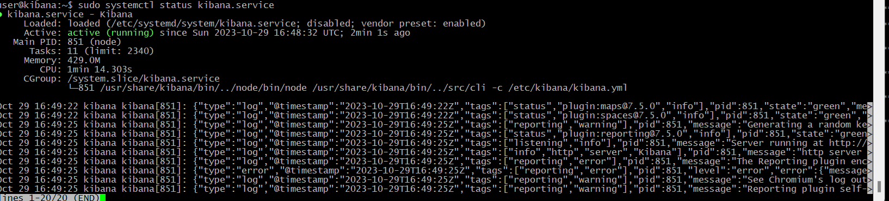

### Проверяем доступность сайта
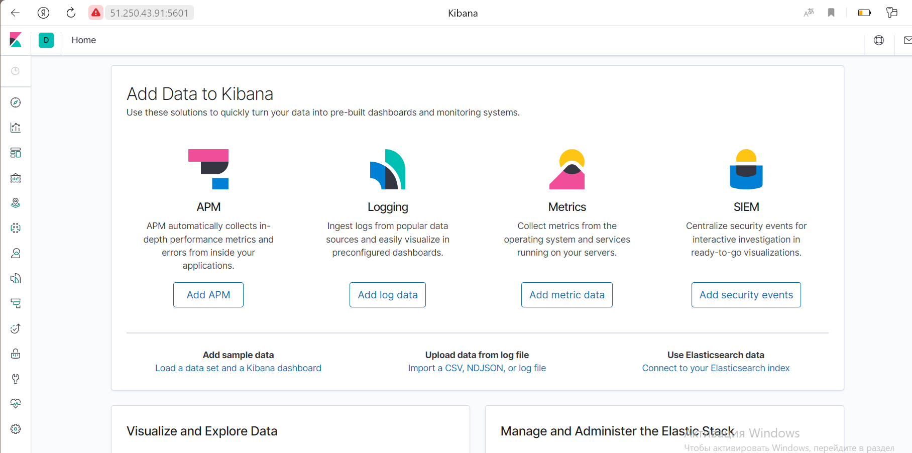

### Смотрим метрику
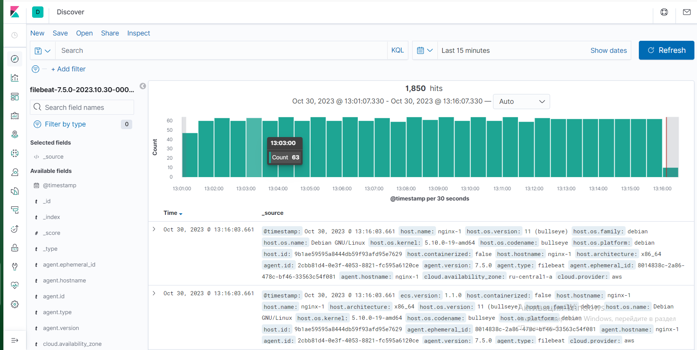

## Сеть
Разверните один VPC. Сервера web, Prometheus, Elasticsearch поместите в приватные подсети. Сервера Grafana, Kibana, application load balancer определите в публичную подсеть.

### VPC 
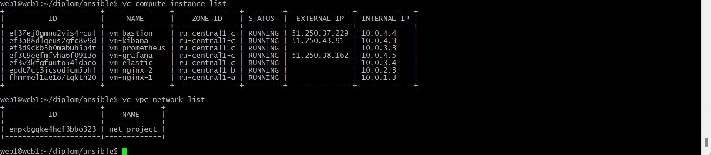

Настройте [Security Groups](https://cloud.yandex.com/docs/vpc/concepts/security-groups) соответствующих сервисов на входящий трафик только к нужным портам.

Настройте ВМ с публичным адресом, в которой будет открыт только один порт — ssh. Настройте все security groups на разрешение входящего ssh из этой security group. Эта вм будет реализовывать концепцию bastion host. Потом можно будет подключаться по ssh ко всем хостам через этот хост.

## Резервное копирование
Создайте snapshot дисков всех ВМ. Ограничьте время жизни snaphot в неделю. Сами snaphot настройте на ежедневное копирование.

### Создаем snapshot
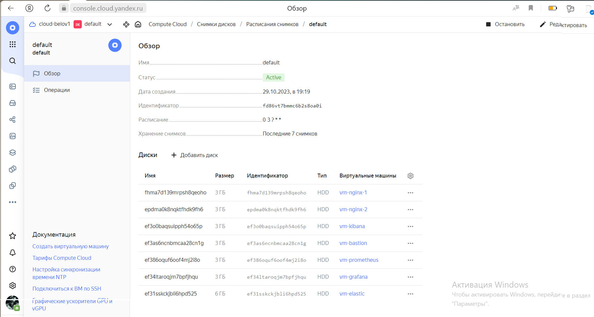

## Дополнительно
Не входит в минимальные требования. 

1. Для Prometheus можно реализовать альтернативный способ хранения данных — в базе данных PpostgreSQL. Используйте [Yandex Managed Service for PostgreSQL](https://cloud.yandex.com/en-ru/services/managed-postgresql). Разверните кластер из двух нод с автоматическим failover. Воспользуйтесь адаптером с https://github.com/CrunchyData/postgresql-prometheus-adapter для настройки отправки данных из Prometheus в новую БД.
2. Вместо конкретных ВМ, которые входят в target group, можно создать [Instance Group](https://cloud.yandex.com/en/docs/compute/concepts/instance-groups/), для которой настройте следующие правила автоматического горизонтального масштабирования: минимальное количество ВМ на зону — 1, максимальный размер группы — 3.
3. Можно добавить в Grafana оповещения с помощью Grafana alerts. Как вариант, можно также установить Alertmanager в ВМ к Prometheus, настроить оповещения через него.
4. В Elasticsearch добавьте мониторинг логов самого себя, Kibana, Prometheus, Grafana через filebeat. Можно использовать logstash тоже.
5. Воспользуйтесь Yandex Certificate Manager, выпустите сертификат для сайта, если есть доменное имя. Перенастройте работу балансера на HTTPS, при этом нацелен он будет на HTTP веб-серверов.

